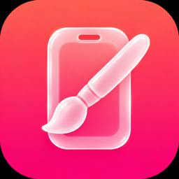
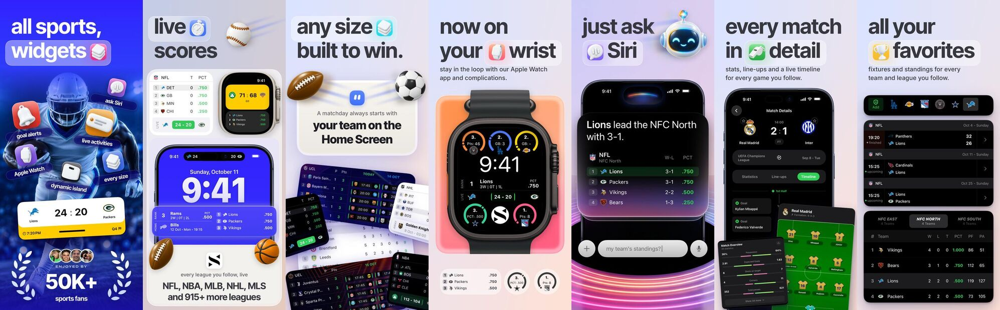

<p align="center">
  
</p>

<h1 align="center">Store Art Studio</h1>

<p align="center">
  <b>Studio-grade App Store and Google Play screenshots, rendered from your app's real views, in every language you sell in.</b><br>
  A Claude Code skill. SwiftUI proven, Jetpack Compose planned. Higgsfield for the art, fastlane for delivery.
</p>

<p align="center">
  <a href="#install">Install</a> ·
  <a href="#quick-start">Quick start</a> ·
  <a href="#match-a-set-you-love">Match a set</a> ·
  <a href="#whats-inside">What's inside</a> ·
  <a href="https://store-art-studio.vercel.app">Web guide</a>
</p>

<p align="center">
  
  <br><sub>A real set made with this method for <a href="https://apps.apple.com/app/id1533789849">Standings</a>: 7 slots in 22 languages, every screen the app's own view rendering real data.</sub>
</p>

---

## Why

Most store screenshots are mockups: a designer redraws the app, a model invents a UI, and the numbers on the phone stop matching the app the week after launch. Localizing them means 20 hand edits that drift.

Store Art Studio treats screenshots as code. Your real SwiftUI views render inside a test target that never launches the app, fed with sample data, on a page built in code. Changing a margin, a headline or a language is one edit and a rerender. The first app built this way shipped 154 screenshots and 22 product page headers from one codebase.

## How it works

| Layer | Made by | Rule |
|---|---|---|
| **Truth** | Your app's own views, rendered host-less from your data | Never redraw, generate or mock up app UI |
| **Atmosphere** | The Higgsfield MCP | Objects, stickers, hands, light, scenes. Never UI, never text |
| **Page** | SwiftUI (or Compose) in a render target | Headline, pill, background, layout, placed by baseline in pixels |
| **Delivery** | fastlane and the store APIs | Exact sizes, an approval list, never submits for review |

The skill works in gates and stops at each one for your approval: setup, a style tile, the hero, the full set, localization, delivery. Before you see any render, it has opened it, looked at it small, compared it with your reference and fixed the differences.

## Install

You need [Claude Code](https://claude.com/claude-code). Clone the repo straight into your skills folder:

```bash
# For every project on this machine
git clone https://github.com/halilyuce/store-art-studio.git ~/.claude/skills/store-art-studio

# Or for one project only, from its root
git clone https://github.com/halilyuce/store-art-studio.git .claude/skills/store-art-studio

# Update later
git -C ~/.claude/skills/store-art-studio pull
```

Restart Claude Code and ask *"Is the store-art-studio skill available?"*.

Then connect the Higgsfield MCP (run `/mcp` in Claude Code and sign in) and follow the setup for your platform:

- **iOS:** add the `StoreArt` render target to your Xcode project. Step by step in the [web guide](https://store-art-studio.vercel.app) or [INSTALL.md](INSTALL.md).
- **Android:** paste the prompt in [templates/android/START-HERE.md](templates/android/START-HERE.md). Claude builds the Compose render target in your project from the iOS template.

<details>
<summary><b>Requirements</b></summary>

| Need | Why |
|---|---|
| macOS with Xcode and an iOS simulator | The iOS renderer is an Xcode unit test bundle with no host app |
| Claude Code | The skill runs inside it |
| Higgsfield MCP with credits | Generates the 3D art. The skill asks before it spends |
| ImageMagick and `swift` | Keying and compositing art, the helper scripts |
| fastlane and an App Store Connect API key | Uploads and Product Page Optimization |
| Apple's product bezels | Download from Apple Design Resources. Their licence forbids redistribution, so they are not in this repo |
| Android: a JDK, Gradle, Paparazzi or Roborazzi | The Compose renderer is a JVM test |

</details>

## Quick start

Copy `templates/brief-template.md` into your project as `docs/screenshots/brief.md`, fill in what you know, and start a session:

```text
Use the store-art-studio skill. Read docs/screenshots/brief.md and start at Gate 0.
Platform: iOS, iPhone 6.9", default language first.
```

The iOS template proves the pipeline before anything else:

```bash
scripts/screenshots/render.sh Sample
scripts/screenshots/tools/verify-export.sh StoreArt/Output 1320x2868
```

That renders a 1320 x 2868 opaque PNG from the sample slot. Swap the placeholder screen for one of your own views and you have your first real slot.

## Match a set you love

Found screenshots you love? Put them in your repo and say what to take from them:

```text
Match this set: docs/screenshots/references/board.jpg.
Take its layout and type, keep our own colours and content.
Use the store-art-studio skill and start with the style tile.
```

The skill cuts the board into slots and measures margins, baselines, type size and palette with `probe.swift`. It builds a style tile for your approval, then loops: render, compare side by side with `compare.swift`, write down every difference, fix. It copies craft, never content: another brand's name, copy, icons and photography stay theirs.

## What's inside

```
SKILL.md                     the contract: layers, hard rules, gates, review loop, slop checklist
INSTALL.md                   step-by-step setup and troubleshooting
index.html                   the web guide (styled like App Store Connect)
references/
  architecture.md            layers, repo layout, the slot pattern, naming, "the world"
  ios-swiftui-renderer.md    building the host-less target, every trap with its fix
  android-compose.md         the same contract for Compose and Google Play
  higgsfield-art.md          what to generate, the MCP flow, keying and compositing recipes
  style-and-copy.md          palette, type, pill, layout archetypes, localization rules
  reference-matching.md      how a shared set is measured and matched
  fastlane-and-delivery.md   deliver, Product Page Optimization, headers, a safety checklist
templates/
  ios/                       StoreArt kit, sample slot and tests (compiles, renders 1320 x 2868)
  android/START-HERE.md      the prompt that builds the Android target
  fastlane/                  screenshots.yml manifest and the lanes
  brief-template.md          start a new app here
scripts/                     chromakey, cutout, screenswap, compare, probe, verify-export, ppo.rb
assets/                      the icon, example screenshots for the web guide, 3D art with provenance
site/                        source of index.html (template and build script)
```

## What's verified

- The iOS template and every Swift script compile. The template renders a 1320 x 2868 opaque PNG on an iOS 26 simulator.
- The method shipped a full 22-language set to App Store Connect, including a Product Page Optimization experiment and headers.
- **Android is a plan, not a result.** If you are the first to run it, the skill records what broke in `references/android-compose.md`. Please send that back.

## The web guide

**[store-art-studio.vercel.app](https://store-art-studio.vercel.app)** is an interactive version of the setup guide, styled like App Store Connect: iOS and Android tracks, copy buttons, progress you can tick off, and the example set in four languages.

It is built from `site/index.template.html`. After editing it, run `python3 site/build.py` and commit both the template and `index.html`.

## A note from me

I was planning to sell this skill. Then I decided to give it back to the community.

If it helps you ship better screenshots, the thank you I would love is simple: download my app **Standings** and, if you enjoy it, leave a rating. It means a lot to a small indie app. No strings attached.

<p>
  <a href="https://apps.apple.com/app/id1533789849">App Store</a> ·
  <a href="https://play.google.com/store/apps/details?id=com.labters.standingswidget">Google Play</a>
</p>

Made by [Halil Yüce](https://github.com/halilyuce). The guide is styled after App Store Connect as a tribute and is not affiliated with Apple.

## Licences

Inter and Inter Tight are bundled under the SIL Open Font License (`templates/ios/Fonts`). Apple bezels and anything you generate under your own Higgsfield account are yours to license and are not included.
